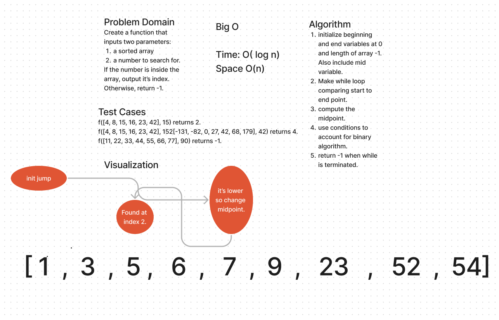

# WhiteBoard




## Code
``` Java
  public static int binaryReturnIndexIfIncluded(int[] arr, int searchVal) {
    int start = 0;
    int end = arr.length -1;

    while(start < end) {
      mid = (start + end)/2;

      if (arr[mid] == searchVal) {
        return mid;
      } 
      else if (searchVal > arr[mid]){
        start = mid + 1;
      }
      else {
        end = mid -1;
      }
    }
    return -1;

  }

```