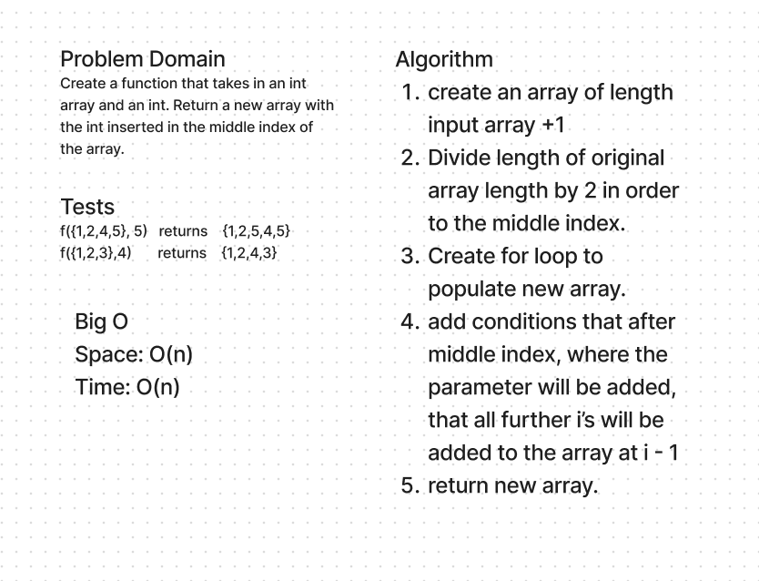

# WhiteBoard



## Code
```java

  public static int[] arrayInsertMiddle(int[] array, int x){
    int length = array.length;
    int[] newArray = new int[length +1];
    int middle = array.length/2;

    for (int i = 0; i < length; i++){
      if (i < middle ){
        newArray[i]=array[i];
      } 
      else if (i == middle) {
        newArray[i] = x;
      } 
      else if (i > middle) {
        newArray[i] = array[i-1];
      }
    }
    return newArray;
  }
```